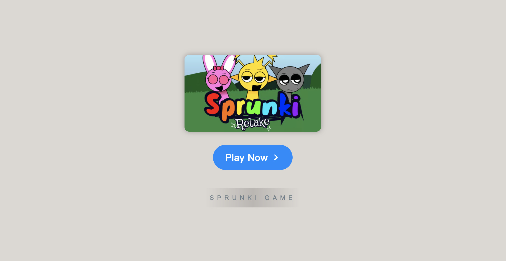

# Sprunki Retake

    

Welcome to **[Sprunki Retake Game](https://sprunkionline.com/retake)**, a fan-created, horror-inspired twist on the popular Incredibox. In this extensive guide, we’ll delve deep into the unique features, game mechanics, phases, and community elements that make Sprunki a one-of-a-kind experience. Prepare to enter a world where music creation is paired with eerie visuals and haunting soundscapes, offering players a suspense-filled musical journey unlike any other.

### Table of Contents
- Introduction
- Features
- Installation
- Gameplay Overview
- Sprunki Phases
- Popular Modes & Mods
- Tips for Success
- Resources

### Introduction

**Sprunki Retake Game** adds an exciting twist to the classic Incredibox experience by introducing original characters, sounds, and mods. Whether you’re an Incredibox fan or new to the game, Sprunki offers hours of musical fun and creativity, available to play online for free. Jump into Sprunki Retake or explore other modes on **Sprunki Phase**.

### Features

| Feature                | Description                                                                          |
|------------------------|--------------------------------------------------------------------------------------|
| **Sprunki Mod**        | Create unique music with Sprunki characters and sounds.                              |
| **Incredibox Phase 3 & 4** | Multiple phases, each with unique characters, sounds, and themes.               |
| **Sprunki Infected**   | Adds a quirky, dark twist to your beats with the Infected mode.                      |
| **Mustard Sprunki**    | A popular character bringing a unique sound to the mix.                              |
| **Online Play**        | No download required—create and share music directly from your browser.              |
| **Free Access**        | Enjoy Sprunki features and mods at no cost.                                          |
| **Community Sharing**  | Save, share, and get feedback on your compositions.                                  |

### Installation

The **Sprunki Retake Game** is entirely browser-based. To get started, follow these steps:

1. **Open Browser**: Use a modern browser like Chrome, Firefox, or Safari.
2. **Visit the Website**:
    - [Sprunki Phase](https://sprunkionline.com/category/sprunki-phase)
    - [Sprunki Retake](https://sprunkionline.com/retake)
3. **Play**: Select "Play" and dive into the Sprunki universe.

### Gameplay Overview

Sprunki Retake is a rhythm and beat creation game that lets players compose music using unique characters:

1. **Choose Characters**: Drag and drop characters, each representing a sound or musical effect, to build your beat.
2. **Mix Sounds**: Combine character sounds to create layered music.
3. **Save & Share**: Once you're satisfied with your mix, save and share it with the community.

### Sprunki Phases

**Sprunki Retake** includes various phases, each introducing new sounds and gameplay experiences:

| Phase              | Description                                                                                       |
|--------------------|---------------------------------------------------------------------------------------------------|
| **Sprunki Phase 3** | Classic sound variations with unique Sprunki styles.                                             |
| **Sprunki Phase 4** | Adds thematic effects and deeper sounds for complex compositions.                                |
| **Sprunki Phase 5** | A darker tone, adding intense beats and "infected" Sprunki characters.                           |
| **Sprunki Phase 6** | Future sounds with upgraded effects, perfect for advanced creators.                              |

Each phase introduces new sounds and characters, providing endless possibilities for musical exploration.

### Popular Modes & Mods

Explore fan-favorite modes and mods for a customized experience:

- **Sprunki Infected Mod**: Dark, moody sounds with Infected Sprunki characters.
- **Sprunki Mustard Mod**: A fan-favorite featuring Mustard Sprunki with unique sound variations.
- **Sprunki Cocrea**: A mode focused on collaboration, allowing you to share and combine creations.
- **Sprunki Parasprunki**: Adds parasitic character interactions, introducing layered sound effects.

### Tips for Success

- **Experiment Freely**: Try different combinations to discover unique sounds.
- **Check Out Tutorials**: YouTube has many Sprunki tutorials to help you master different phases.
- **Engage with the Community**: Share your work, get feedback, and find inspiration from other players.

### Resources

Explore the official sites for more modes and updates:

- [Sprunki Phase](https://sprunkionline.com/category/sprunki-phase)
- [Sprunki Retake](https://sprunkionline.com/retake)

Happy composing and enjoy your musical journey in the world of Sprunki!
